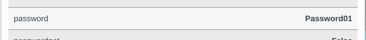

# tobh
Fetches hashcat cracked NTLM's to Bloodhound. Adds `password` parameter to each user and marks them as `pwned`.

## usage example
```bash
hashcat -m1000 -a 3 domain.ntds --username --show --outfile-format=2 | tobh
```


